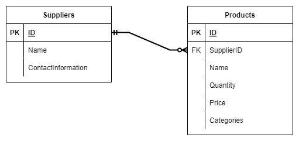

## Model

### ERD

As you can see from above the system have 2 tables Suppliers and Products.  
In this models:
- Each products can have only one supplier
- Each supplier can have 0 or more products
So we can say **that** our relation of this 2 models are one-to-many relation ship

### Product

| Field      | Type    | Required?          |
| ---------- | ------- | ------------------ |
| ID         | STRING  | :heavy_check_mark: |
| SupplierID | STRING  | :heavy_check_mark: |
| Name       | STRING  | :heavy_check_mark: |
| Quantity   | INT     | :heavy_check_mark: |
| Price      | DECIMAL | :heavy_check_mark: |
| Categories | STRING  | :heavy_check_mark: |

:warning: **NOTE** :

- You can make the categories have multiple value by seperate it by comma(,)

### ProductCreated

| Field      | Type    | Required?          |
| ---------- | ------- | ------------------ |
| SupplierID | STRING  | :heavy_check_mark: |
| Name       | STRING  | :heavy_check_mark: |
| Quantity   | INT     | :heavy_check_mark: |
| Price      | DECIMAL | :heavy_check_mark: |
| Categories | STRING  | :heavy_check_mark: |

### ProductUpdated

| Field      | Type    | Required? |
| ---------- | ------- | --------- |
| SupplierID | STRING  |           |
| Name       | STRING  |           |
| Quantity   | INT     |           |
| Price      | DECIMAL |           |
| Categories | STRING  |           |

### Suppiler

| Field              | Type   | Required?          |
| ------------------ | ------ | ------------------ |
| ID                 | INT    | :heavy_check_mark: |
| Name               | STRING | :heavy_check_mark: |
| ContactInformation | STRING | :heavy_check_mark: |

### SuppilerCreated

| Field              | Type   | Required?          |
| ------------------ | ------ | ------------------ |
| Name               | STRING | :heavy_check_mark: |
| ContactInformation | STRING | :heavy_check_mark: |

### SuppilerUpdated

| Field              | Type   | Required? |
| ------------------ | ------ | --------- |
| Name               | STRING |           |
| ContactInformation | STRING |           |

### Result

| Field   | Type          |
| ------- | ------------- |
| Success | BOOLEAN       |
| Message | STRING        |
| Data    | (GenericType) |

The result model is the response type from API with generic data depend on response from endpoint.

## API - ENDPOINT

### PRODUCT

| METHOD | ENDPOINT           | Params     | Body                  | Response                | Description          |
| ------ | ------------------ | ---------- | --------------------- | ----------------------- | -------------------- |
| GET    | /api/products      |            |                       | Result\<List\<Product>> | Get all products     |
| GET    | /api/products/{id} | id: String |                       | Result<Product?>        | Get product by id    |
| POST   | /api/products      |            | ProductCreated        | Result\<Product?>       | Create new product   |
| PUT    | /api/products      |            | List\<ProductUpdated> | Result\<List\<Product>> | Edit products        |
| PATCH  | /api/products/{id} | id: String | ProductUpdated        | Result\<Product?>       | Edit product by id   |
| DELETE | /api/products/{id} | id: String |                       | Result\<bool>           | Delete product by id |

### SUPPILER

| METHOD | ENDPOINT            | Params     | Body                   | Response                 | Description           |
| ------ | ------------------- | ---------- | ---------------------- | ------------------------ | --------------------- |
| GET    | /api/suppilers      |            |                        | Result\<List\<Supplier>> | Get all suppliers     |
| GET    | /api/suppilers/{id} | id: String |                        | Result<Supplier?>        | Get supplier by id    |
| POST   | /api/suppilers      |            | SupplierCreated        | Result\<Supplier?>       | Create new supplier   |
| PUT    | /api/suppilers      |            | List\<SupplierUpdated> | Result\<List\<Supplier>> | Edit suppliers        |
| PATCH  | /api/suppilers/{id} | id: String | SupplierUpdated        | Result\<Supplier?>       | Edit supplier by id   |
| DELETE | /api/suppilers/{id} | id: String |                        | Result\<bool>            | Delete supplier by id |
